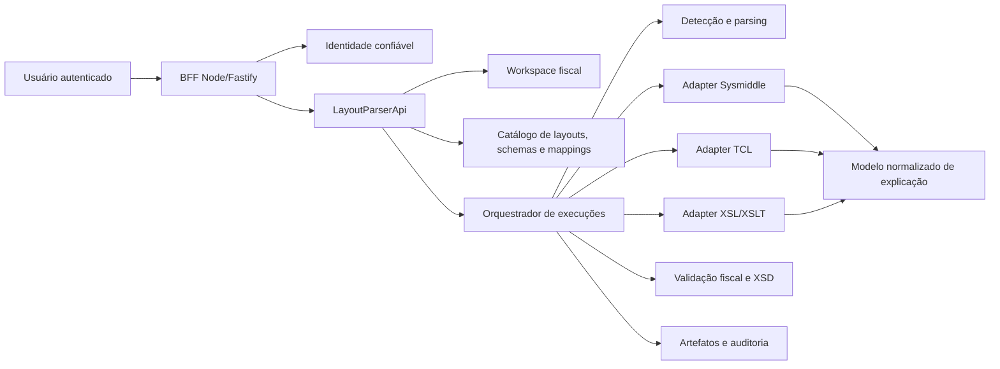

# Arquitetura-alvo — Plataforma fiscal de mapeamento documental

> Status: **proposta em implementação**
> Escopo: LayoutParserReact + BFF Node/Fastify, com contratos cross-repo para LayoutParserApi
> Atualizado em: 2026-08-31

## 1. Decisão de produto

O LayoutParser não será posicionado como um mapeador universal. Seu domínio é a integração fiscal
brasileira, com regras fortes para criação, inspeção, transformação e validação de documentos como:

- NF-e;
- CT-e;
- MDF-e;
- NFS-e;
- NFCom.

Formatos como TXT posicional, MQSeries, IDoc, XML, XSL/XSLT e JSON são meios de entrada, saída ou
autoria. O produto vendável é a capacidade de transformar um documento fiscal A em um documento
fiscal B com explicação, validação e rastreabilidade.

### Proposta de valor

> Descobrir, explicar, editar, transformar e validar documentos fiscais brasileiros, preservando a
> origem física de cada campo e tornando legíveis as regras que produziram o documento final.

### Diferenciais que devem ser preservados

1. Detecção automática e explicável do layout mais compatível.
2. Edição posicional fail-closed, sem deslocar campos.
3. Proveniência campo a campo entre origem e destino.
4. Diagnóstico separado por motor de transformação.
5. Regras fiscais e versões de schema como elementos de primeira classe.
6. Revisão humana antes de publicar uma transformação.

## 2. Limites de responsabilidade

| Camada           | Responsabilidade                                                                                                       |
| ---------------- | ---------------------------------------------------------------------------------------------------------------------- |
| React            | Experiência de produto, navegação, autoria visual e apresentação de explicações já normalizadas.                       |
| BFF Node/Fastify | Sessão, identidade confiável, autorização de fronteira, limites, rate limit e proxy same-origin.                       |
| LayoutParserApi  | Fonte da verdade de usuários internos, workspaces, documentos, regras fiscais, layouts, mappings, versões e execuções. |
| Motores          | Executar Sysmiddle, TCL, XSL/XSLT e futuros adapters sem expor detalhes inseguros ao navegador.                        |
| Persistência     | Guardar metadados e artefatos segundo tenant, política de retenção e classificação do dado.                            |

O front-end **não** interpreta regra fiscal, não decide validade de documento e não tenta inferir a
semântica de uma DSL proprietária. A API devolve um modelo de explicação normalizado.

## 3. Arquitetura funcional



### Fluxo de uma análise

```text
Upload
  → identificar família/layout
  → criar AnalysisRun no workspace
  → parsear e registrar proveniência
  → avaliar candidatos de transformação
  → validar schema e regras fiscais
  → registrar artefatos, diagnósticos e correlation ID
  → permitir revisão, edição e reprocessamento
```

### Fluxo de autoria de mapping

```text
Schema de origem + schema de destino
  → mapping em Draft
  → regras normalizadas e visualização explicável
  → casos de teste e cobertura dos destinos
  → revisão/aprovação
  → versão imutável
  → promoção development → validation → production
```

## 4. Modelo de domínio

### Agregados principais

```text
User
└── WorkspaceMembership
    └── FiscalWorkspace
        ├── FiscalProject
        │   ├── DocumentAnalysis
        │   │   ├── SourceArtifact
        │   │   ├── ParseSnapshot
        │   │   └── TransformationRun
        │   └── MappingDefinition
        │       ├── MappingVersion
        │       ├── MappingRule
        │       ├── MappingTestCase
        │       └── MappingRelease
        ├── SchemaAsset
        └── RetentionPolicy
```

### Identificadores

- `UserId`: UUID interno criado pela API.
- `ExternalIdentity`: chave única por `provider + issuer/tenant + subject`.
- `WorkspaceId`, `ProjectId`, `AnalysisId`, `MappingId`: UUID/ULID opaco e imutável.
- Nome, e-mail e login são atributos mutáveis; nunca são chave de propriedade.
- `CorrelationId` rastreia uma requisição, mas não substitui `AnalysisId` ou `RunId`.

### Tipos fiscais

O catálogo deve modelar separadamente:

- `FiscalDocumentType`: `nfe`, `cte`, `mdfe`, `nfse`, `nfcom`;
- versão do documento/schema, por exemplo `4.00`;
- operação: emissão, evento, cancelamento, distribuição ou conversão;
- jurisdição quando aplicável, especialmente NFS-e;
- formato físico: fixed-width, MQSeries, IDoc, XML, JSON;
- direção e finalidade da transformação.

NFS-e não deve ser tratada como um schema nacional único: município/provedor/padrão e versão fazem
parte da identidade do schema.

## 5. Identidade e workspace

### Decisão

O login OIDC já captura `provider`, `subject` e, no Entra, `tenantId`. O BFF deve remover qualquer
header homônimo vindo do navegador e encaminhar esses valores apenas na conexão confiável com a
API. A API resolve ou cria o usuário interno e suas memberships.

```text
OIDC identity
  provider = entra | google
  subject = identificador imutável do provedor
  issuer/tenant = contexto de emissão
        ↓
ExternalIdentity única
        ↓
UserId interno
        ↓
WorkspaceMembership
```

### Regras

- não vincular workspace por nome/e-mail;
- não expor `subject` bruto ao JavaScript;
- não persistir documento fiscal ou histórico em `localStorage`;
- um usuário pode participar de vários workspaces;
- o workspace pessoal inicial pode ser criado automaticamente;
- permissões são por workspace/recurso, não uma única flag global `isAdmin`;
- acesso a cada artefato deve validar membership no servidor.

### Papéis iniciais

| Papel       | Capacidades                                              |
| ----------- | -------------------------------------------------------- |
| Owner       | Configuração, membros, retenção e exclusão do workspace. |
| FiscalAdmin | Catálogo fiscal, schemas, layouts e releases.            |
| Mapper      | Criar e editar mappings e testes.                        |
| Reviewer    | Revisar, aprovar ou rejeitar versões.                    |
| Operator    | Executar análises e reprocessamentos.                    |
| Viewer      | Consultar resultados e explicações sem alterar.          |

## 6. Explicabilidade de TCL, XSL/XSLT e Sysmiddle

### Modelo canônico

Cada motor deve produzir um `MappingExplanation`, não HTML e não uma descrição livre. O contrato
contém:

- metadados do mapping e versão;
- grafo de nós de origem, regra e destino;
- regras ordenadas com identificadores estáveis;
- referências a campos/XPath;
- condição legível e representação estruturada;
- funções chamadas e parâmetros;
- cardinalidade/loop;
- constantes, lookups e concatenações;
- nível de suporte/confiança;
- limitações e trechos opacos;
- origem da explicação: declarada, compilada, inferida ou indisponível.

### Visualização no front

O Mapping Studio terá três áreas:

1. **Origem**: árvore de linhas/campos ou XML.
2. **Regras**: ligações e blocos de transformação.
3. **Destino**: árvore do schema fiscal/XML final.

Ao selecionar uma regra, o inspetor deve explicar em português:

```text
Quando LINHA001.tpAmb = "2",
copie LINHA004.CNPJ para /NFe/infNFe/emit/CNPJ,
removendo espaços laterais.
```

Também deve existir uma visão técnica com XPath, função, parâmetros e referência de origem.

### XSL/XSLT

É viável analisar `xsl:template`, `xsl:value-of`, `xsl:for-each`, `xsl:if`, `xsl:choose`, variáveis
e chamadas conhecidas na API. Extensões/custom code devem aparecer como `opaque` até existir um
adapter seguro.

### TCL

O adapter deve usar a representação declarada/AST produzida pelo parser TCL e nunca depender de
regex no navegador. A regra normalizada precisa preservar a referência à linha/campo original.

### Sysmiddle

É viável explicar a parte declarativa disponível no XML/mapper e correlacioná-la com
`fieldMappings`/`sectionMappings`. Funções proprietárias sem tradução conhecida devem aparecer como
bloco opaco, com nome e argumentos permitidos, sem decompilar ou publicar código de terceiro.

O contrato deve distinguir:

- `authoritative`: veio da definição executada;
- `best_effort`: composição estrutural incompleta;
- `opaque`: existe uma regra, mas sua semântica não pode ser aberta;
- `unsupported`: o adapter ainda não oferece explicação.

## 7. Arquitetura de informação do front-end

```text
/workspace                         visão inicial e análises recentes
/workspaces/:workspaceId/projects projetos fiscais
/projects/:projectId/analyses     histórico de documentos
/projects/:projectId/mappings     catálogo de mappings
/mappings/:mappingId/versions/:v  Mapping Studio
/runs/:runId                      execução, diagnóstico e artefatos
/catalog                          schemas/layouts fiscais
/admin                            operação global, separada da administração do workspace
```

### Estados obrigatórios

Toda tela remota deve possuir loading, vazio, erro, acesso negado e sucesso. URLs precisam ser
recarregáveis e compartilháveis apenas com usuários que tenham autorização para o recurso.

## 8. Persistência e retenção

Metadados e conteúdo devem ser separados:

- banco relacional: usuários, memberships, projetos, mappings, versões, runs e auditoria;
- object storage ou repositório de artefatos: documentos, XML, XSLT, relatórios e diffs;
- hash criptográfico: integridade e deduplicação sem substituir autorização;
- logs: correlation IDs e metadados sanitizados, nunca conteúdo fiscal bruto.

Políticas por workspace:

- retenção de documento de origem;
- retenção de saída e diagnóstico;
- redaction/mascaramento de CPF/CNPJ quando aplicável;
- exclusão sob solicitação e trilha de auditoria;
- opção de processamento sem retenção do conteúdo, mantendo apenas metadados permitidos.

## 9. Requisitos não funcionais

- isolamento por workspace testado no backend;
- autorização fail-closed em todos os recursos;
- auditoria de criação, alteração, aprovação, execução e download;
- versão imutável para mapping publicado;
- idempotência em criação de análise e reprocessamento;
- jobs longos assíncronos com status e cancelamento;
- virtualização de documentos e árvores grandes no front;
- WCAG 2.2 AA para os fluxos principais;
- observabilidade por `WorkspaceId`, `ProjectId`, `RunId` e `CorrelationId`, sem PII nos logs;
- backups, restore testado e estratégia de rollback.

## 10. Decisões e não objetivos

### Decidido

- produto nichado em documentos fiscais brasileiros;
- API é fonte da verdade do workspace e das regras fiscais;
- identidade imutável do provedor é a amarração inicial do usuário;
- explicabilidade usa contrato canônico independente do motor;
- histórico fiscal não será armazenado no navegador;
- Sysmiddle será tratado por adapter seguro e degradável.

### Fora do P0

- billing e marketplace;
- mapeamento genérico de qualquer formato sem relação fiscal;
- execução de código arbitrário no navegador;
- colaboração em tempo real;
- substituição imediata dos motores Sysmiddle/TCL existentes.
